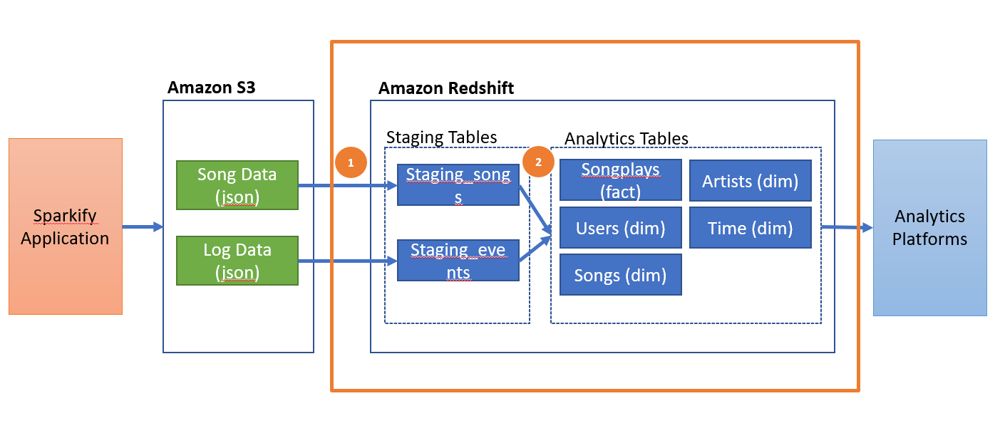
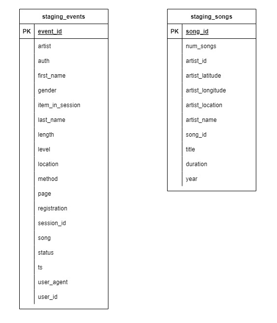
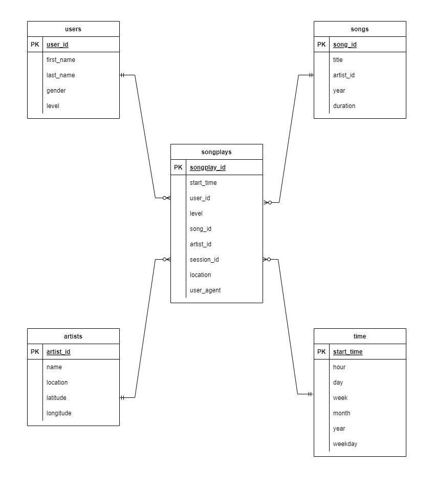

# Sparkify Data Warehouse

## Background
Sparkify is a fictional music streaming company. They have been operating for some time and collected logs on user activity and song data. With their growing user base and song database, they realize that the next step for the company is to gather insights from their data.

In this project, we as the data engineers build an ETL pipeline that extracts the data which is stored in S3, stages the data in Redshift, and transforms the data into the dimensional table. This dimensional table will be used by the analytics team to find out what songs users are listening to.


## Raw Data Overview
Sparkify stores their data in AWS S3 as json files.
The data consist of Log Data and Song Data

### Log Data
Log data records the user interaction with Sparkify application. 
It is stored in the following S3 bucket: [s3://udacity-dend/log_data](s3://udacity-dend/log_data). The log for each day is stored as a separate json file and put under the year and month folder.
```
log_data/2018/11/2018-11-12-events.json
log_data/2018/11/2018-11-13-events.json
```
This is how the content of a json file looks like:
```json
{"artist":null,"auth":"Logged In","firstName":"Walter","gender":"M","itemInSession":0,"lastName":"Frye","length":null,"level":"free","location":"San Francisco-Oakland-Hayward, CA","method":"GET","page":"Home","registration":1540919166796.0,"sessionId":38,"song":null,"status":200,"ts":1541105830796,"userAgent":"\"Mozilla\/5.0 (Macintosh; Intel Mac OS X 10_9_4) AppleWebKit\/537.36 (KHTML, like Gecko) Chrome\/36.0.1985.143 Safari\/537.36\"","userId":"39"}
{"artist":null,"auth":"Logged In","firstName":"Kaylee","gender":"F","itemInSession":0,"lastName":"Summers","length":null,"level":"free","location":"Phoenix-Mesa-Scottsdale, AZ","method":"GET","page":"Home","registration":1540344794796.0,"sessionId":139,"song":null,"status":200,"ts":1541106106796,"userAgent":"\"Mozilla\/5.0 (Windows NT 6.1; WOW64) AppleWebKit\/537.36 (KHTML, like Gecko) Chrome\/35.0.1916.153 Safari\/537.36\"","userId":"8"}
```

### Song Data
Song data records the details of the song.
It is stored in the following S3 bucket: [s3://udacity-dend/song_data](s3://udacity-dend/song_data). Each song is stored in a json file and placed under the first 3 letter of song track ID folders.
```
song_data/A/B/C/TRABCEI128F424C983.json
song_data/A/A/B/TRAABJL12903CDCF1A.json
```
This is the sample of the content of the json file
```json
{"artist_id":"ARIOZCU1187FB3A3DC","artist_latitude":null,"artist_location":"Hamlet, NC","artist_longitude":null,"artist_name":"JOHN COLTRANE","duration":220.44689,"num_songs":1,"song_id":"SOCEMJV12A6D4F7667","title":"Giant Steps (Alternate Version_ Take 5_ Alternate)","year":0}
```


## Project Architecture
In this project, we built an ETL pipeline to extract song data and log data and transform them into an analytics database for the analytics team 
The ETL process consists of two steps:
1. Load the data from S3 to staging tables in Redshift
2. Transform the data from staging tables to analytics tables in the same Redshift instance



## Table Design
### Staging Tables
Staging tables store the logs data and the songs data in the same format as the raw data. There is no transformation applied.


### Analytics Tables
Analytics tables are optimized for analytics purpose. They are designed using the star schema. The fact table is the songplays table. The dimension tables are songs, artists, users, and time tables.




## Project Files 

### Creating RedShift Cluster.ipynb
This is a jupyter notebook file to create redshift cluster in AWS and destroy the cluster after we have finished the project

### create_table.py
This is a python file to create the staging tables and the analytics tables in the Redshift cluster.

### etl.py
This is a python file to load the data from S3 to staging tables, and then transform the data to analytics table

### sql_queries.py
This file list all the SQL queries required for the table creation and the etl process

### dwh.cfg
This is a config file which list all the configuration required in this project. Please refer to [Getting Started Section](#Getting Started) on what value to be provided.


## Getting Started
### Create an AWS Account
Please follow the instruction on this [link](https://aws.amazon.com/premiumsupport/knowledge-center/create-and-activate-aws-account/)

### Create a new IAM User and store the access key and secret in dwh.cfg
In this project, we are going to create the Redshift cluster instance using AWS Python SDK. We need an AWS access account to do so. 
Please follow this step to create one:
- Go to AWS IAM service and click on the "Add user" button to create a new IAM user in your AWS account.
- Choose a name of your choice.
- Select "Programmatic access" as the access type. Click Next.
- Choose the Attach existing policies directly tab, and select the "AdministratorAccess". Click Next.
- Skip adding any tags. Click Next.
- Review and create the user. It will show you a pair of access key ID and secret.
- Take note of the pair of access key ID and secret. This pair is collectively known as Access key.
- Store the access key and secret in the [AWS] section in the dwh.cfg


### Create Redshift cluster
We are going to create and destroy the Redshift cluster programmatically.

**Create Redshift Cluster**
- Open `Creating Redshift Cluster.ipynb`
- Run all the following steps:
  - Import required libraries and read the config file
  - Create clients for IAM and Redshift
  - Create IAM Role to be able to read S3
  - Create Redshift Cluster
  - Describe the Cluster
  - Check connection to Cluster - you should see `Connected: dwhuser@dwh`
  

### Create Tables
After the Redshift cluster is ready, we can proceed to create the tables:
```commandline
python create_tables.py
```

### Run the ETL
```commandline
python etl.py
```
The ETL process will take some time ~1-2 hours.

### Test with sample query

**Getting top 10 users based on the activity**
```
SELECT users.user_id as user_id,
	users.first_name as first_name,
    users.last_name as last_name,
    users.gender as gender,
    users.level as level,
    count(users.user_id) as total_count
FROM songplays join users 
    ON songplays.user_id=users.user_id
GROUP BY  users.user_id, users.first_name, users.last_name, users.gender, users.level
ORDER BY count(users.user_id) desc 
LIMIT 10
```

**Getting top 10 songs that users listen to**
```commandline
SELECT songs.title as song_title,
       artists.name as artist_name, 
       count(songs.title) as total_count 
FROM songplays JOIN songs 
    ON songplays.song_id=songs.song_id join artists on songs.artist_id=artists.artist_id
GROUP BY songs.title, artists.name 
ORDER BY total_count desc 
LIMIT 10
```

### Clean up the Redshift Cluster

Run the following steps in `Creating Redshift Cluster.ipynb`:
- Delete the Redshift Cluster
- Remove the Iam Role